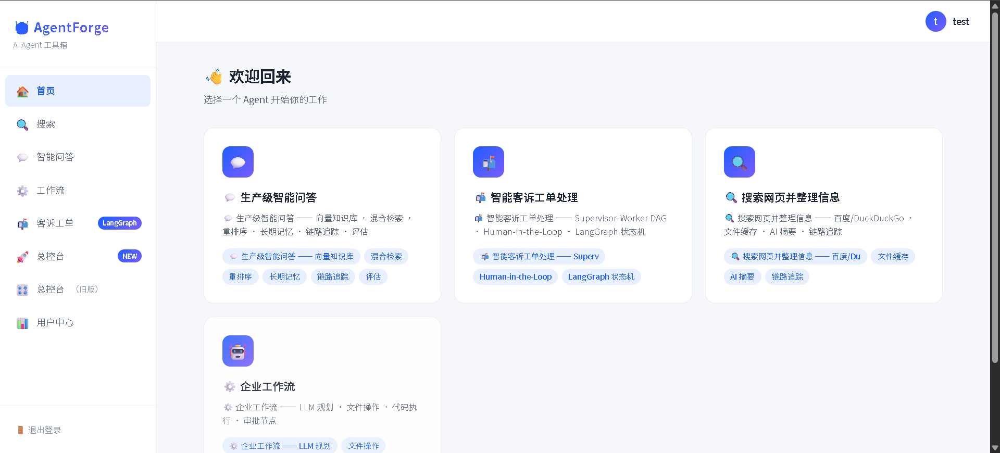
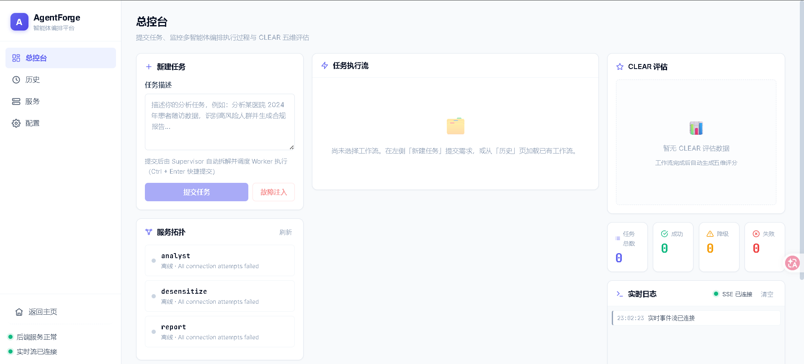
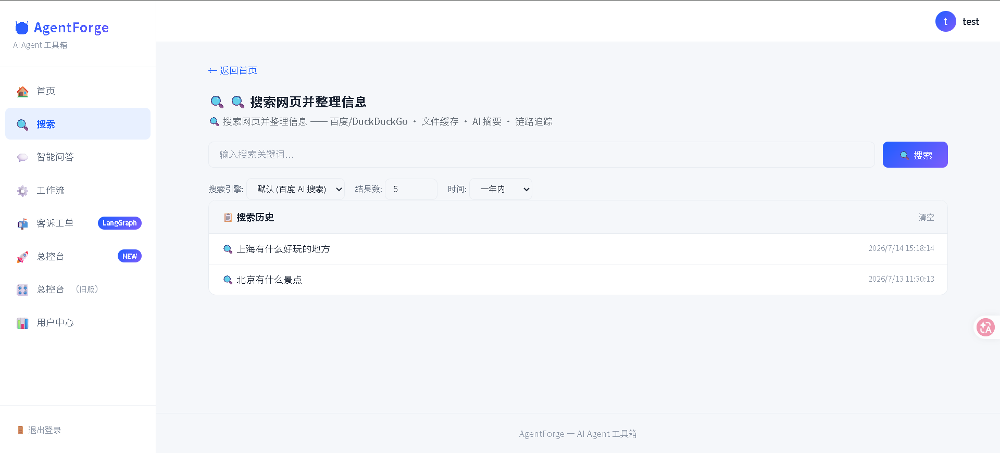
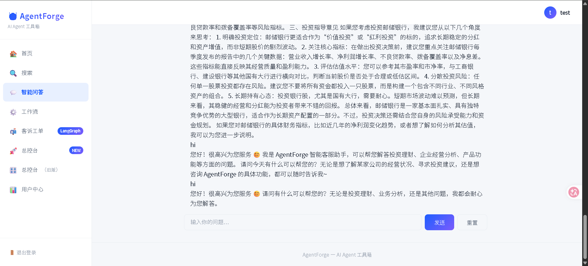
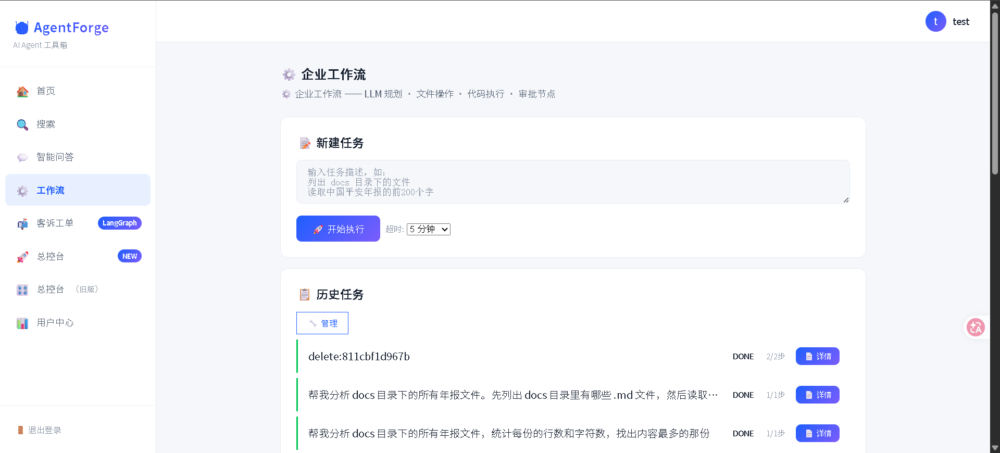
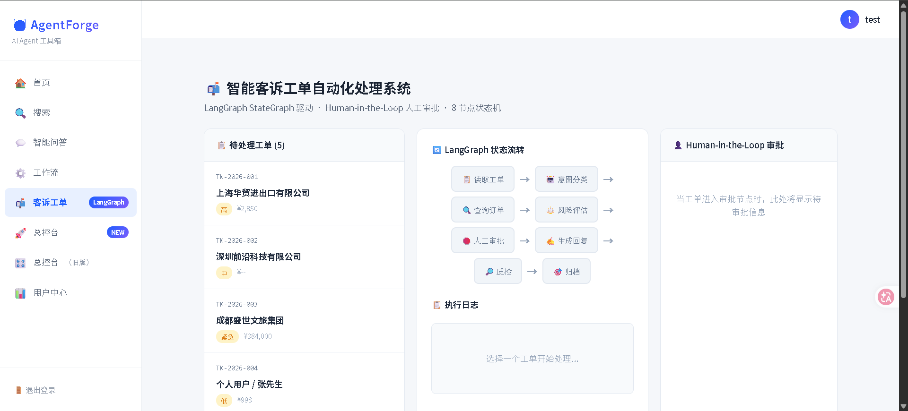
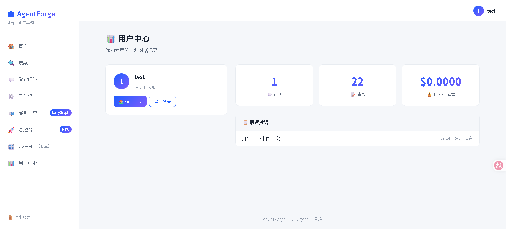

# 🤖 AgentForge — 企业级多智能体编排平台

> AI Agent 全栈学习项目 | Supervisor-Worker 微服务 | LangGraph 客诉工单 | 白底 SaaS 仪表盘

[](https://python.org)
[](https://fastapi.tiangolo.com)
[](https://langchain-ai.github.io/langgraph/)
[](https://docs.docker.com/compose/)
[](tests.py)

---

## 📸 项目总览

### 首页 — 4 个 Agent

<p align="center">
  
</p>

---

### 总控台 — 任务编排 + CLEAR 评估

<p align="center">
  
</p>

---

## 🔍 四大 Agent

### 搜索 Agent — 联网检索 + AI 摘要

调用百度 / DuckDuckGo 搜索 API，LLM 自动汇总搜索结果。

<p align="center">
  
</p>

---

### 智能问答 Agent — RAG 知识库

基于 ChromaDB 向量存储 + 混合检索（RRF 融合），实现多轮知识库问答。

<p align="center">
  
</p>

---

### 工作流 Agent — 任务拆解执行

复杂任务自动拆解为 DAG 步骤，串行/并行执行，实时追踪进度。

<p align="center">
  
</p>

---

### 客诉工单 Agent — LangGraph 8 节点状态机

<p align="center">
  
</p>

基于 LangGraph StateGraph 实现：
- **8 节点**：读单 → 意图分类 → 订单查询 → 风险评估 → 人工审批 → 生成回复 → 质检 → 归档
- **条件路由**：根据金额和策略自动分流（自动批准 / 人工审批）
- **Human-in-the-Loop**：`interrupt()` 暂停 + `Command(resume)` 恢复，演示审批面板

---

### 用户中心

<p align="center">
  
</p>

---

## 🛠️ 技术栈

| 层级 | 技术 |
|:----|:-----|
| **Web 框架** | FastAPI + Jinja2 |
| **Agent 编排** | LangGraph StateGraph + 自研 Supervisor |
| **记忆系统** | ChromaDB 向量存储 + SQLite 持久化 |
| **LLM** | DeepSeek v4（兼容 OpenAI API）+ 离线 Mock 模式 |
| **通信协议** | MCP (JSON-RPC) + A2A (AgentCard) |
| **容器化** | Docker + Docker-Compose（5 节点） |
| **CI/CD** | GitHub Actions + pytest（21 个用例） |
| **前端** | ECharts + SSE 实时推送 + Inter 字体 |

---

## 🚀 快速启动

```bash
# 1. 克隆项目
git clone https://github.com/alexispan117/agent_forge.git
cd agent_forge

# 2. 安装依赖
python -m venv .venv
source .venv/bin/activate   # Windows: .venv\Scripts\activate
pip install -r requirements.txt

# 3. 配置环境变量（默认 Mock 模式无需 API Key 即可运行）
cp .env.example .env

# 4. 启动
python -m uvicorn interfaces.app:app --host 0.0.0.0 --port 8000

# 5. 浏览器访问
# 首页:      http://localhost:8000/
# 总控台:    http://localhost:8000/orchestrator
# 客诉工单:  http://localhost:8000/complaints
```

> ℹ️ 默认开启 **离线 Mock 模式**（`LLM_MOCK_MODE=true`），无需任何 API Key。

## 🐳 Docker 部署

```bash
docker-compose up -d
```

---

## 📁 项目结构

```
agent_forge/
├── core/                # 内核层（LLM工厂、故障自愈、配置）
├── orchestration/       # 编排层（Supervisor、ReAct、LangGraph客诉、CLEAR评估）
├── memory/              # 记忆层（短/长/情景三级）
├── runtimes/            # 运行时（Searcher、KnowledgeBot、Workflow、Complaint）
├── toolkit/             # 工具包（向量存储、注册中心、适配器）
├── infrastructure/      # 基础设施（熔断、审批、持久化、成本追踪）
├── interfaces/          # 接口层（FastAPI路由、Jinja2模板、SSE）
├── services/            # 微服务入口（Supervisor + 3 Worker）
├── data/demo/           # 演示数据（合同、审计规则、客诉工单）
├── docs/screenshots/    # 界面截图
├── tests.py             # pytest（21 个用例）
├── docker-compose.yml   # 5 容器编排
└── Dockerfile           # 通用镜像
```

---

## 📝 License

MIT
